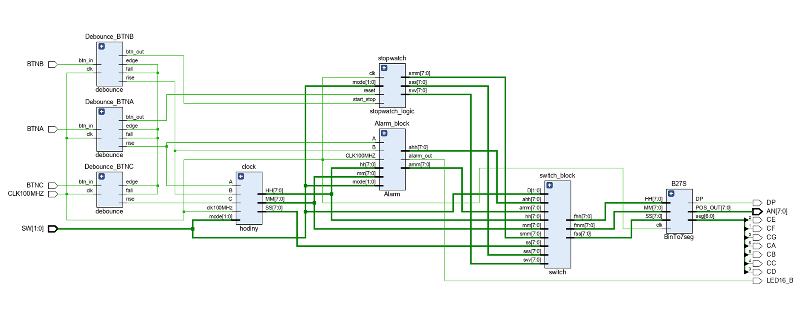
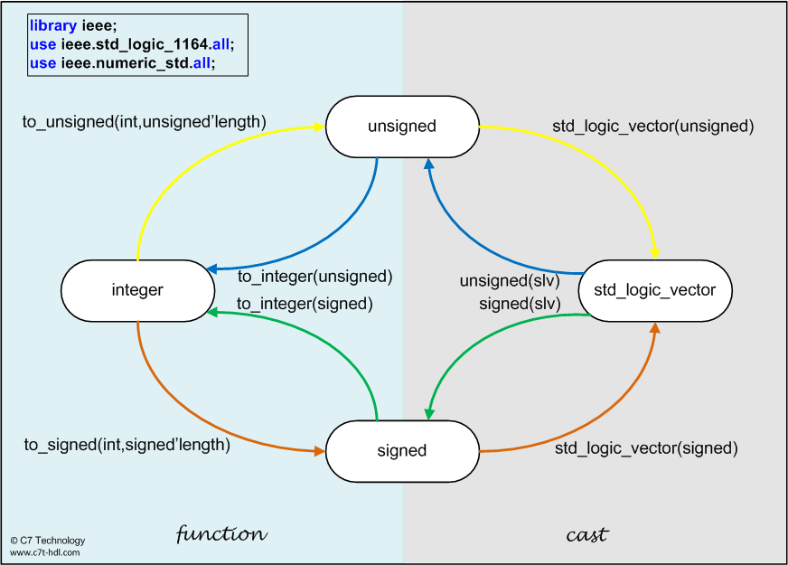

# Team members

    soudruh předseda Pochyčenkovič (řídí ministerstvo rozvoje a kultury VHDL kódu)
    soudruh Matějkin (prostý občan [bude dělat všechnu práci], momentálně je poslední v pořadníku s 5 letou čekací doubou na byt a předposlední v pořadníku se 7 letou čekací dobou na auto)
    soudružka Annovična (poctivá udavačka chyb a závad VHDL kódu, není soudruha na nějž by nic nenašla)
    soudruh Kubínovič (příslušník Veřejné bezpečnosti VHDL kódu, dohlíží na korektnost a správnost jak chování soudruhů tak VHDL kódu)

# Digital Clock

This project details the design and implementation of a versatile digital clock using VHDL (VHSIC Hardware Description Language). The system incorporates three key functionalities: a real-time clock displaying hours, minutes, and seconds; an alarm feature allowing users to set a specific time for an alert; and a stopwatch capable of measuring elapsed time. The design utilizes a modular approach, breaking down the system into distinct VHDL entities for timekeeping, alarm control, and stopwatch operation. These modules are then interconnected to create a comprehensive digital time management system. Simulation and synthesis results will be presented to validate the functionality and performance of the designed clock. This project demonstrates the application of VHDL in creating practical digital systems with real-world applications.

**The main contributions of the project are:**

    Pochyčenkovič (Sedmisegmentovku, Stopky, Top_level )
    Matějkin      (Hodiny )
    Annovična     (Switch )
    Kubínovič     (Alarm )
    

                    

[Link to your short video presentation.](https://drive.google.com/file/d/1JJ692UHHd7oOWDBoQ0ek7HKJ6iFH9hNW/view?usp=drivesdk)

# Theoretical description and explanation

The core of our digital clock project lies in the principles of digital logic and sequential circuit design. The VHDL code implements several key modules that interact to provide the desired functionality.

Timekeeping Module (Hodiny): This module, expertly handled by soudruh Matějkin, forms the heart of the real-time clock. It utilizes a counter-based approach, typically driven by a stable clock signal. The counter increments with each clock pulse, and when it reaches a specific value (e.g., for seconds, it counts up to 59), it resets to zero and increments the next higher unit (minutes). A similar process occurs for minutes and hours. The module needs to handle the rollover from 23:59:59 to 00:00:00.

Alarm Control Module (Alarm): Soudruh Kubínovič, the guardian of VHDL code correctness, has diligently crafted the alarm module. This component allows the user to set a specific time. It continuously compares the current time from the timekeeping module with the set alarm time. When a match occurs, the alarm module generates an output signal, which can then be used to trigger an audible or visual alert. The module will likely include logic for enabling and disabling the alarm.

Stopwatch Module (Stopky): Under the watchful eye of soudruh předseda Pochyčenkovič, the stopwatch module provides the ability to measure elapsed time. It typically includes control signals for start, stop, and reset. When started, a counter begins to increment based on the clock signal. Stopping the stopwatch freezes the counter value, displaying the elapsed time. Resetting sets the counter back to zero.

Seven-Segment Display Driver (Sedmisegmentovku): Another crucial contribution from soudruh předseda Pochyčenkovič is the module responsible for displaying the time and other information on seven-segment displays. This module takes binary-coded decimal (BCD) or binary inputs representing digits and converts them into the appropriate output signals to illuminate the correct segments of the display. Multiplexing techniques might be employed to drive multiple displays using a limited number of output pins.

Switch Interface (Switch): Soudružka Annovična, our meticulous detector of flaws, has implemented the switch interface. This module handles the input from user-operated switches. These switches are likely used to set the alarm time, control the stopwatch (start, stop, reset), and potentially select different modes of operation. The switch interface needs to debounce the mechanical switches to prevent multiple transitions from being registered for a single press.

Top-Level Module (Top_level): Soudruh předseda Pochyčenkovič has also overseen the creation of the top-level module. This entity acts as the central point of interconnection, instantiating and connecting all the other modules (Timekeeping, Alarm, Stopwatch, Seven-Segment Driver, and Switch Interface). It defines the overall architecture of the digital clock and manages the signals exchanged between the sub-modules.

Insert descriptive text and schematic(s) of your implementation.

# Software description

Put flowchats/state diagrams of your algorithm(s) and direct links to source/testbench files in src and sim folders. Put a descriptive top-level schematic of your application.

Component(s) simulations

Write descriptive text and put simulation screenshots of your components.
References

**Put here all references to sources and tools you used.**
   * [TB generator](https://vhdl.lapinoo.net/)
   * [EDA Playground](https://www.edaplayground.com/)
   * [TerosHDL](https://github.com/tomas-fryza/vhdl-course/wiki/How-to-install-TerosHDL-on-Windows-and-Linux)
   * [ghdl + GtkWave](https://github.com/tomas-fryza/vhdl-course/wiki/How-to-install-ghdl-on-Windows-and-Linux)
   * [ModelSim](https://www.intel.com/content/www/us/en/software-kit/750666/modelsim-intel-fpgas-standard-edition-software-version-20-1-1.html)
   * [Live Share](https://code.visualstudio.com/learn/collaboration/live-share), a Visual Studio Code plugin for a real-time collaborative development
   * [other tools](https://github.com/tomas-fryza/vhdl-course/wiki)

