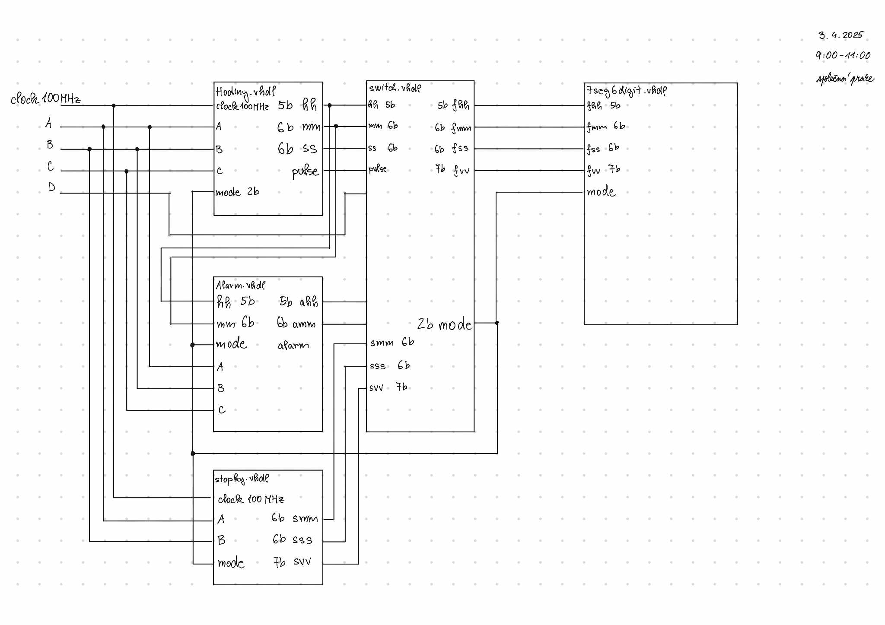

# Team members

    soudruh předseda Pochyčenkovič (řídí ministerstvo rozvoje a kultury VHDL kódu)
    soudruh Matějkin (prostý občan [bude dělat všechnu práci], momentálně je poslední v pořadníku s 5 letou čekací doubou na byt a předposlední v pořadníku se 7 letou čekací dobou na auto)
    soudružka Annovična (poctivá udavačka chyb a závad VHDL kódu, není soudruha na nějž by nic nenašla)
    soudruh Kubínovič (příslušník Veřejné bezpečnosti VHDL kódu, dohlíží na korektnost a správnost jak chování soudruhů tak VHDL kódu)

# Digital Clock

This project details the design and implementation of a versatile digital clock using VHDL (VHSIC Hardware Description Language). The system incorporates three key functionalities: a real-time clock displaying hours, minutes, and seconds; an alarm feature allowing users to set a specific time for an alert; and a stopwatch capable of measuring elapsed time. The design utilizes a modular approach, breaking down the system into distinct VHDL entities for timekeeping, alarm control, and stopwatch operation. These modules are then interconnected to create a comprehensive digital time management system. Simulation and synthesis results will be presented to validate the functionality and performance of the designed clock. This project demonstrates the application of VHDL in creating practical digital systems with real-world applications.

**The main contributions of the project are:**

    Pochyčenkovič (je zodpovědný za - )
    Matějkin      (je zodpovědný za - )
    Annovična     (je zodpovědný za - )
    Kubínovič     (je zodpovědný za - )
    

                    
[Photo of your application with labels of individual parts.]

[Link to your short video presentation.]
# Theoretical description and explanation

Enter a description of the problem and how to solve it.
Hardware description of demo application

Insert descriptive text and schematic(s) of your implementation.
# Software description

Put flowchats/state diagrams of your algorithm(s) and direct links to source/testbench files in src and sim folders. Put a descriptive top-level schematic of your application.
Component(s) simulations

Write descriptive text and put simulation screenshots of your components.
References

**Put here all references to sources and tools you used.**
   * [EDA Playground](https://www.edaplayground.com/)
   * [TerosHDL](https://github.com/tomas-fryza/vhdl-course/wiki/How-to-install-TerosHDL-on-Windows-and-Linux)
   * [ghdl + GtkWave](https://github.com/tomas-fryza/vhdl-course/wiki/How-to-install-ghdl-on-Windows-and-Linux)
   * [ModelSim](https://www.intel.com/content/www/us/en/software-kit/750666/modelsim-intel-fpgas-standard-edition-software-version-20-1-1.html)
   * [Live Share](https://code.visualstudio.com/learn/collaboration/live-share), a Visual Studio Code plugin for a real-time collaborative development
   * [other tools](https://github.com/tomas-fryza/vhdl-course/wiki)

