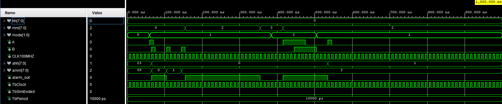

# Alarm
This block converts HH:MM:SS input to 6 7-segment displays.

[Source file](../../src/Alarm.vhd)
[Testbench](Alarm_tb.vhd)

## Simulation results
In this simulation the block is correctly converting input values to 7 seg display and outputs correct display position
