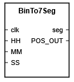

# BinTo7Seg
This block converts HH:MM:SS input to 6 7-segment displays.

## Simulation results
In this simulation the block is correctly converting input values to 7 seg display and outputs correct display position
