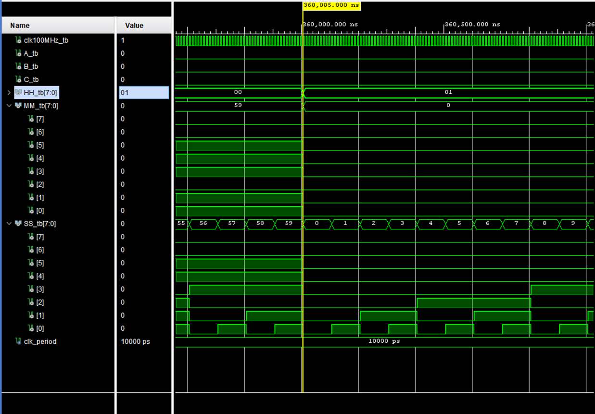

# Hodiny
Na náběžnou hranu hodinového signálu reaguje signál count, který počítá do hodnoty 99 999 999, jakmile nabide této hodnoty tak se počítadlo sekund zvedne o +1, až přeteče počítadlo sekund tak se zvednou minuty o +1 a přetečení minut se zvednou hodiny o +1. Po přetečení hodin se čas vyresetuje na 0.

[Source file](../../src/hodiny.vhd)
[Testbench](hodiny_tb.vhd)

## Simulation results

