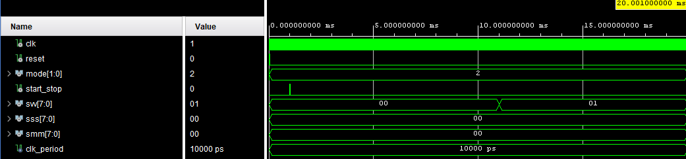
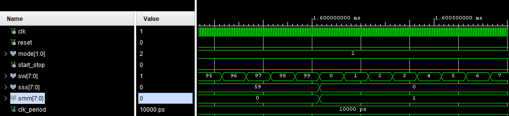

# Stopky
This block acts as a stopwatch with MM:SS:CS output logic vectors

## Simulation results
In this simulation stopwatch start counting correctly

In this simulation individual counters correctly stop at their supposed values
