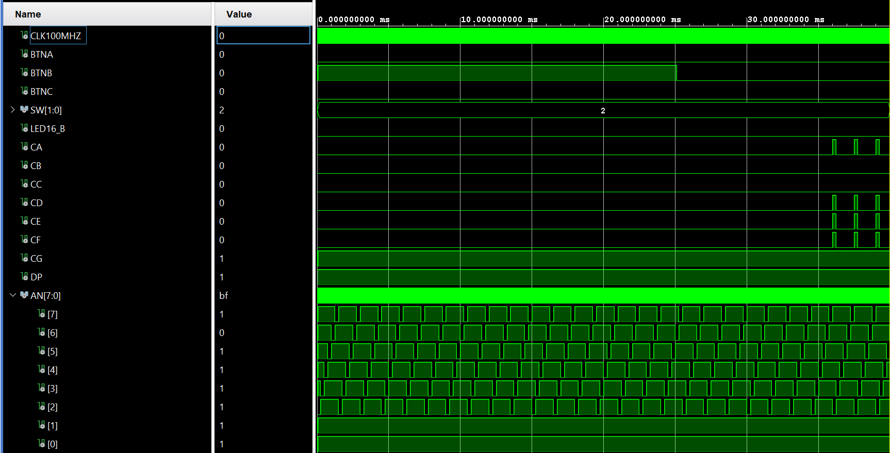

# Clock
This block acts as the whole clock with MM:SS:CS output to 7 seg displays and buttons as inputs

## Simulation results
In this simulation the top_level is outputing correct 7 seg display position and has started diplying time for stopwatch

